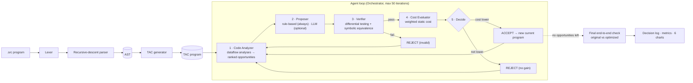

# Automated LLM/Agent-Guided Compiler Code Optimization

A multi-agent system that compiles programs written in a small C-like language
to **Three-Address Code (TAC)** and then optimizes the TAC in an agent loop:

**Analyze → Propose → Verify → Evaluate → Accept/Reject**

Every candidate transformation must pass verification **before** it is even
costed, so an incorrect optimization can never be accepted. On the bundled
500-program dataset, the rule-based agent alone reaches an **82.5 % average
cost reduction**. With Google Gemini as an additional proposer it reaches
**91.5 %**. Both runs have **zero false positives**.

| Result (500 programs) | Rule-based only | Rule-based + Gemini |
|---|---|---|
| Average cost reduction | 82.49 % | **91.50 %** (median 97.53 %) |
| Programs with > 30 % reduction | 500 / 500 | 500 / 500 |
| Proposals / verified / accepted | 10,628 / 10,628 / 10,517 | 10,978 / 10,952 / 10,828 |
| Verification pass rate | 100.00 % | 99.76 % |
| Acceptance rate (of verified) | 98.96 % | 98.87 % |
| Steps to convergence (mean / median) | 22.2 / 20 | 22.7 / 20.5 |
| LLM validity rate | n/a | 92.35 % (26 wrong proposals blocked) |
| False positives (output mismatch) | **0** | **0** |

The rule-only run is kept in `output_rule_only/`; the Gemini run is in `output/`.

---

## Architecture



```
src/
  frontend/   lexer.py, parser.py, ast_nodes.py, tac_generator.py
  tac/        instruction.py, program.py, interpreter.py, printer.py, dataflow.py
  agents/     orchestrator.py, code_analyzer.py, optimizer_rule.py, optimizer_llm.py,
              verifier.py, cost_evaluator.py, decision_log.py
  visualization/  charts.py, report.py
dataset/      generator.py, programs/<category>/*.src
tests/        one test module per component (190 tests)
output/       logs/ (per-program .log + .json), metrics/ (CSV + JSON), plots/ (PNG)
```

`src/tac/dataflow.py` is one addition to the requested layout. It holds the
CFG, liveness, available-copies and definite-assignment analyses, which the
analyzer, the optimizer and `TACProgram.get_input_variables()` all use.

---

## Installation

```bash
pip install -r requirements.txt
```

Python 3.10+ is required (the code uses `match` statements). PNG export of
the Sankey diagram uses `kaleido`, which needs a Chrome/Chromium/Edge browser
installed. The HTML version of the Sankey is always written next to the PNG.

## Usage

```bash
python main.py --generate-dataset                     # 500 programs -> dataset/programs/
python main.py --run-all --output-dir output          # optimize everything, print logs + metrics
python main.py --run-all --quiet                      # same, but only progress lines on the console
python main.py --run-file dataset/programs/loops/loops_001.src
python main.py --visualize --output-dir output        # the 6 charts, from saved results
python main.py --run-all --use-llm                    # add the Claude-based proposer
```

| Flag | Meaning |
|---|---|
| `--max-iterations N` | iteration cap per program (default 50) |
| `--use-llm` | enable the LLM proposer alongside the rules |
| `--llm-provider P` | `anthropic` (default) or `gemini` |
| `--llm-model ID` | model for `--use-llm` (defaults: `claude-sonnet-4-20250514`, `gemini-3.1-flash-lite`) |
| `--compare-with DIR` | with `--visualize`: compare against another run (writes `comparison.csv` and chart 7) |
| `--max-llm-calls N` | LLM proposals allowed per program (default 5) |
| `--quiet` | with `--run-all`, print only progress; logs are still saved |

## Running the tests

```bash
python -m pytest tests/ -v
```

190 tests cover every component. The verifier tests inject wrong changes
(bad folds, operand swaps, CSE across non-commutative ops, deleted live
stores, off-by-one conditions, removed loop increments, deleted trapping
divisions, reordered output). Each one must be rejected.

---

## The mini-language

```c
int a = 3 + 5;                 // declarations (int x; initialises to 0)
a = a * 2;                     // assignment
if (a > 10 && a != 12) { print(a); } else { print(0); }
while (a > 0) { a = a - 3; }
for (int i = 0; i < 4; i = i + 1) { print(i % 2); }
```

Operators: `+ - * / %`, comparisons `== != < > <= >=`, logical `&& || !`,
unary `-`. Integers are unbounded. `/` truncates toward zero and `%` follows
the sign of the dividend (C semantics). `&&`/`||` evaluate both operands.
`//` and `/* */` comments are supported.

A variable that is read but never assigned is a **program input**. Dataset
programs that use inputs list them in an `// inputs:` header comment, and the
verifier feeds them values.

---

## The agent loop

1. **Analyze** (`code_analyzer.py`). Every analysis runs on the
   instruction-level control-flow graph, so it is sound for loops and
   branches, not only straight-line code.

   | Opportunity | Priority | Detection |
   |---|---|---|
   | `CONSTANT_FOLD` | 100 | binary/unary op on literals (`5 / 0` is never folded) |
   | `ALGEBRAIC_SIMPLIFY` | 90 | `x+0, 0+x, x-0, x*1, 1*x, x*0, 0*x, x/1, x-x, x%1` |
   | `DEAD_CODE` | 80 | result not live (backward liveness analysis), and the instruction cannot trap |
   | `CSE` | 70 | same `(op, a, b)` in one basic block, commutative ops normalised, operands and first result not redefined in between |
   | `STRENGTH_REDUCTION` | 60 | `x*2 → x+x`, `x*2^k → x<<k` |
   | `COPY_PROPAGATION` | 50 | `x = y` propagated wherever the copy is *available* (forward must-analysis), plus copy coalescing `t = a op b; x = t → x = a op b` |

2. **Propose.** `RuleBasedOptimizer.propose()` deep-copies the program and
   applies exactly one opportunity. With `--use-llm`, `LLMOptimizer` asks
   Claude for one optimization whenever a rule proposal is turned down, or
   once the rules run out. The reply is parsed back into TAC and goes
   through the same gates as a rule proposal.
3. **Verify** (`verifier.py`). Both checks must pass:
   * **Differential testing.** The original and candidate run in the TAC
     interpreter on 20 random input sets (values in [-100, 100]) plus edge
     cases (all 0 / 1 / -1 / 99 / -99). When there are free inputs, it also
     adds boundary values `c-1, c, c+1` for every literal `c` in either
     program. Printed output *and* failure mode (division by zero, timeout,
     undefined variable) must match. Both programs timing out counts as
     inconclusive and is rejected.
   * **Symbolic verification** (straight-line code). Values become canonical
     integer polynomials, so `x*2 ≡ x+x ≡ x<<1` and `a+b ≡ b+a`. Comparisons
     are normalised, so `x > y ≡ y < x`. Printed expressions must be
     identical, and so must the set of divisors that could trap before each
     print. For programs with branches or loops this step is skipped and the
     log says so.
4. **Evaluate** (`cost_evaluator.py`):
   `cost = 1.0·instructions + 2.0·arithmetic + 0.5·temps + 1.5·copies + 1.0·branches`.
   A candidate is accepted only if this cost **strictly** decreases.
5. **Accept/Reject.** An accepted candidate becomes the current program, and
   the "already tried" set is cleared because new opportunities may appear.
   Rejected opportunities are not retried until something else is accepted.
   The loop ends when nothing is left to try or the iteration cap is hit.
   Finally the optimized program is verified once more against the untouched
   original (`output_match`).

### Why zero false positives

* Nothing is accepted without passing the verifier. The final check
  re-verifies the end result against the original.
* A dataset program with no free inputs has exactly one possible execution,
  so a differential match is a *proof* of equivalence for it.
* For straight-line code with inputs, the symbolic check proves equivalence
  for all inputs (within the polynomial normal form).
* For branching code with inputs, differential testing is strong but not
  exhaustive. That matters only for LLM proposals: the rule-based
  transformations are correct by construction, and the verifier is their
  safety net.

### Design notes on the cost model

The cost weights make a copy (`x = y`, 2.5) dearer than a comparison or
unary op (1.0). So some textbook steps would *raise* cost when applied alone,
and the strict cost gate would reject them. Two rules take care of this:

* **Copy propagation** removes the copy in the same step when it becomes dead.
  Otherwise the step would be cost-neutral.
* **Constant folding** of a comparison, logical, shift or unary op forwards
  the folded constant into its uses in the same step. Arithmetic folds are
  a plain replace, as specified.

`x*2 → x+x` is cost-neutral under these weights, so the evaluator rejects it.
These are the 97 strength-reduction rejections in the results. `x*4 → x<<2`
is accepted, because a shift is not one of the arithmetic ops `+ - * / %`.

---

## Metrics

| Metric | Definition |
|---|---|
| Verification pass rate | proposals passing verification / all proposals |
| Acceptance rate | accepted / proposals that passed verification |
| Average cost reduction | mean of `(original − final) / original × 100` over programs |
| Steps to convergence | iterations per program (mean, median, min/max, distribution) |
| LLM validity rate | LLM proposals passing verification / LLM proposals (only with `--use-llm`) |
| False positives | programs whose optimized output differs from the original. **Must be 0** |

Written to `output/metrics/metrics_summary.{json,csv}`,
`output/metrics/per_program_results.csv`, and `output/metrics/results.json`
(full per-program records, used by `--visualize`).

Per category (from `output/metrics/comparison.csv`):

| Category | Programs | Rule-based only | Rule-based + Gemini | Programs improved by Gemini |
|---|---:|---:|---:|---:|
| arithmetic | 60 | 96.0 % | 96.0 % | 0 |
| nested | 60 | 98.1 % | 98.2 % | 2 |
| repeated_expr | 60 | 80.7 % | 81.7 % | 7 |
| dead_code | 60 | 97.4 % | 97.4 % | 0 |
| loops | 80 | 65.1 % | **93.3 %** | 73 |
| conditionals | 80 | 73.9 % | **84.1 %** | 46 |
| mixed | 100 | 77.9 % | **91.6 %** | 68 |
| **all** | 500 | 82.5 % | **91.5 %** | 196 (none worse) |

With rules alone, loops and conditionals reduce least, because the six rule
types never remove branches. Gemini closes most of that gap. It evaluates
whole constant loops (for example, "adds −4 twelve times" becomes
`print -48`) and simplifies branches that the rules leave alone.

### Results with Gemini (`gemini-3.1-flash-lite`, free tier)

* **Run time and calls.** The full run took 43 minutes and made about 380
  API calls. 226 programs were already provably minimal after the rules, so
  the LLM was not consulted for them.
* **Proposal outcomes.** Of 340 parseable Gemini proposals:
  * 262 were accepted;
  * 52 were correct but did not lower the cost;
  * 26 were **wrong and rejected by the verifier**.
  * A further 25 replies could not be parsed as TAC, and 18 returned the
    program unchanged.
* **Validity rate.** 92.35 % of parseable proposals passed verification
  (86.0 % if the 25 unparseable replies are also counted as failures).
* **Example of a blocked wrong proposal** (`conditionals_002`). Gemini
  claimed its rewrite was "an equivalent expression". Differential testing
  found `in_n = 20`, where the original prints 16 and the rewrite prints 20,
  so the change was rejected.
* **Independent re-check.** Every original source program was re-run
  against its final optimized TAC on fresh random inputs (seed and range
  different from the verifier's): 3,776 executions, **0 mismatches**.

## Visualizations (`output/plots/`)

Chart 7 is produced only with `--visualize --compare-with output_rule_only`.

1. **Sankey.** Total proposals → passed verification / invalid → accepted / rejected (plus an interactive HTML version).
2. **Grouped bars.** Accepted / rejected / invalid counts per optimization type.
3. **Line chart.** Cost per iteration for five representative programs, each the one closest to its category's median reduction.
4. **Donut chart.** Share of accepted optimizations by type.
5. **Scatter (small multiples).** Agent steps vs. cost improvement, one panel per category plus an "all programs" panel, each with a linear trend line.
6. **Heatmap.** Category × optimization type, number of accepted applications.
7. **Comparison.** Average cost reduction per category, rule-based only vs. rule-based + LLM.

---

## Example decision log

`dataset/programs/repeated_expr/repeated_expr_009.src`:

```c
// inputs: in_b, in_a
int a = in_b + in_a;
int h = in_b + in_a;
int s = a + h;
print(s);
```

```
=== Program: repeated_expr_009.src ===
--- Iteration 1 ---
  [ANALYZE] Found 7 opportunities: CSE (priority=70), COPY_PROPAGATIONx6 (priority=50)
  [PROPOSE] Applying CSE at instruction 2: t1 = in_b + in_a → t1 = t0
  [VERIFY]  PASS (differential: 25/25 inputs matched, symbolic: equivalent)
  [COST]    Before: 19.0, After: 18.5 (reduction: 2.6%)
  [ACCEPT]  ✓ Change accepted
--- Iteration 2 ---
  [ANALYZE] Found 5 opportunities: COPY_PROPAGATIONx5 (priority=50)
  [PROPOSE] Applying COPY_PROPAGATION at instruction 1: a = t0 → uses of a -> t0 at instr 4
  [VERIFY]  PASS (differential: 25/25 inputs matched, symbolic: equivalent)
  [COST]    Before: 18.5, After: 16.0 (reduction: 13.5%)
  [ACCEPT]  ✓ Change accepted
  ...
--- Iteration 5 ---
  [ANALYZE] Found 2 opportunities: COPY_PROPAGATIONx2 (priority=50)
  [PROPOSE] Applying COPY_PROPAGATION at instruction 2: t2 = t0 + t0; s = t2 → s = t0 + t0
  [VERIFY]  PASS (differential: 25/25 inputs matched, symbolic: equivalent)
  [COST]    Before: 10.5, After: 7.5 (reduction: 28.6%)
  [ACCEPT]  ✓ Change accepted
--- Iteration 6 ---
  [ANALYZE] No more opportunities found.
=== RESULT ===
  Original cost: 19.0
  Final cost:    7.5
  Reduction:     60.5%
  Iterations:    6
  Accepted:      5
  Rejected:      0
  Invalid:       0
  Output match:  PASS ✓
=== Original TAC ===
  0 |     t0 = in_b + in_a
  1 |     a = t0
  2 |     t1 = in_b + in_a
  3 |     h = t1
  4 |     t2 = a + h
  5 |     s = t2
  6 |     print s
=== Optimized TAC ===
  0 |     t0 = in_b + in_a
  1 |     s = t0 + t0
  2 |     print s
```

---

## The LLM optimizer (optional)

`--use-llm` adds an LLM proposer (`src/agents/optimizer_llm.py`). It shares
one prompt and one reply parser across two providers, chosen with
`--llm-provider`:

| Provider | Default model | Credentials | Cost |
|---|---|---|---|
| `gemini` | `gemini-3.1-flash-lite` | `GEMINI_API_KEY`, or a `.gemini_key` file in the project root | free tier |
| `anthropic` | `claude-sonnet-4-20250514` | `ANTHROPIC_API_KEY` from console.anthropic.com | paid per use |

```powershell
# put your AI Studio key (aistudio.google.com) in .gemini_key -- it is git-ignored
python main.py --run-file dataset/programs/loops/loops_001.src --use-llm --llm-provider gemini
python main.py --run-all --quiet --use-llm --llm-provider gemini --max-llm-calls 2
python main.py --visualize --compare-with output_rule_only     # adds chart 7 + comparison table
```

When the LLM is consulted:
* after a rule-based proposal is rejected, and
* once the rule-based opportunities run out.

It is **not** consulted when the program is already nothing but
`print <constant>` lines. That form is provably minimal, so a call could only
waste quota.

**Gemini free-tier notes** (measured October 2026):
* **Quotas are per model, per day.** `gemini-3.5-flash` allows only
  **20 requests/day**, which ran out after 11 programs.
  `gemini-3.1-flash-lite` answers in about 4 s and is the default.
  The Gemma 4 models were correct but took about 2 minutes per call.
* Calls are spaced about 6.5 s apart.
* A 429 (quota) is retried twice; if it persists, the LLM switches off and
  the run finishes rule-based.
* A 500/503 ("high demand") is retried three times; if it persists, only that
  proposal is skipped.
* Free-tier prompts may be used by Google to improve its products.

**Chat subscriptions (Claude Pro, ChatGPT Plus/Go) do not include API
access.** Without a key, the optimizer reports itself unavailable and the
run continues rule-based only. LLM proposals are counted separately
(`llm_proposals`, `llm_valid`) and reported as the LLM validity rate.
